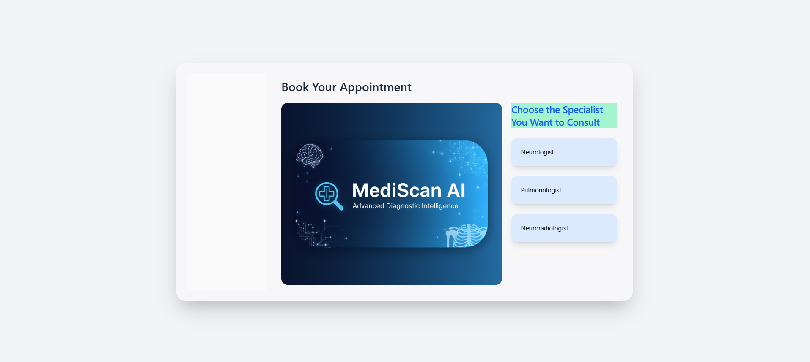
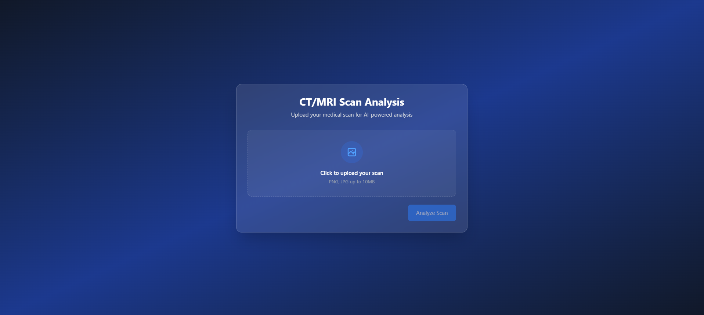
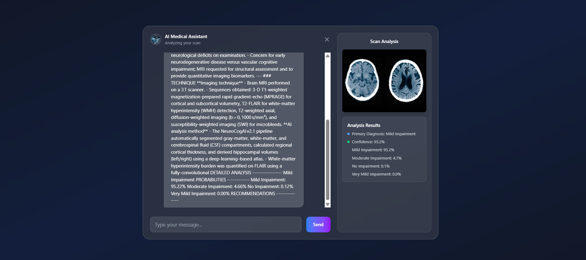

## Virtual Hospital AI Assistant

### An end-to-end AI prototype for medical imaging analysis and doctor consultation

## Overview / Demo

This project lets users upload medical scans (Brain MRI, Alzheimer’s-related scans, and Chest CT), runs PyTorch models to infer findings, then generates a structured clinical report with an LLM. Users can continue with a context-aware virtual doctor consultation.

```
Frontend → FastAPI → PyTorch Models → LLM → Response
```

## Features

- 🧠 Brain MRI, Alzheimer’s, Chest CT analysis (PyTorch)
- 📄 AI-generated clinical reports (LangChain + NVIDIA LLM)
- 💬 Virtual doctor consultation (context-aware chat)
- 🌐 Full-stack app (FastAPI backend + Tailwind frontend)

## Tech Stack

- Backend: FastAPI, Python 3.10+
- ML: PyTorch, TorchVision, PIL
- LLM & Orchestration: LangChain, NVIDIA AI Endpoints (ChatNVIDIA)
- Frontend: Tailwind CSS 4, vanilla HTML/JS

## Architecture / How It Works

- User uploads scan from the frontend page
- FastAPI receives the image and writes a temp file
- PyTorch model runs inference and returns prediction + probabilities
- LLM generates a structured clinical report from the model output
- A session ID is returned; user can chat with the AI doctor (context kept per session)

High-level flow:

```
[Browser UI]
  └── Upload Scan + Chat
       │
       ▼
[FastAPI Backend]
  ├── /upload-scan → routes to model → builds prompt → LLM report
  └── /doctor-consultation → context-aware Q&A per session
       │
       ▼
[PyTorch Models]  [LLM (NVIDIA ChatNVIDIA via LangChain)]
```

## Setup Instructions

### Prerequisites

- Python 3.10+
- NVIDIA API key (for LLM): set `NVIDIA_API_KEY` in `.env`
- Install system dependencies for PyTorch if using GPU (optional)

### Backend

```bash
git clone <repo>
cd virtualHospital
pip install -r requirements.txt
uvicorn main:app --reload
```

### Frontend

- Build Tailwind output CSS (if you change styles):

```bash
npx @tailwindcss/cli -i ./src/input.css -o ./src/output.css --minify
```

- Open `src/dashboard.html` in your browser and navigate to a specialty page.

## Configuration

- Create a `.env` file (see `.env.example`):

```
NVIDIA_API_KEY=your_api_key_here
```

- Model weights: update paths to avoid absolute `E:\virtualHospital\MODELS\...` if your environment differs. Prefer using environment variables or relative paths.

## Usage

### Upload a Scan (via frontend)

1. Open `src/dashboard.html`
2. Choose a specialty page
3. Upload an image (JPG/PNG), click Analyze
4. Review the generated clinical report and start chatting

### SCREENSHOTS





### Upload a Scan (via curl)

```bash
curl -X POST http://localhost:8000/upload-scan \
  -F "image=@/path/to/scan.jpg" \
  -F "filename=scan.jpg" \
  -F "exam_type=brain"
```

### Start/continue a consultation

```bash
curl -X POST http://localhost:8000/doctor-consultation \
  -F "session_id=<returned_session_id>" \
  -F "user_message=What does the report mean?"
```

### Example Response (upload)

```json
{
  "status": "success",
  "session_id": "20250101_120000",
  "clinical_report": "...structured report text...",
  "detailed_findings": "glioma_tumor",
  "probabilities": {
    "glioma_tumor": 0.82,
    "meningioma_tumor": 0.1,
    "no_tumor": 0.05,
    "pituitary_tumor": 0.03
  },
  "recommendations": "...",
  "doctor_response": null,
  "analysis_points": [
    { "color": "blue", "text": "Primary Diagnosis: glioma_tumor" },
    { "color": "green", "text": "Confidence: 82.0%" }
  ]
}
```

## Limitations & Disclaimer

- ⚠️ This is a prototype/research project and is NOT for clinical use.
- Models are trained on limited datasets; outputs may be inaccurate or biased.
- No authentication, persistence, or PHI handling is provided; do not use with real patient data.

## Future Work

- Replace hardcoded model paths with configuration/env vars
- Add authentication and a database/Redis for session storage
- Improve validation, error handling, and security (CORS, file type/size limits)
- Add deployment configs and CI
